# Document Classification using Longformer

Deep learning system for **classifying long scientific documents** using
the Longformer transformer architecture.\
This project demonstrates how modern transformer architectures can
efficiently process **long sequences** and improve classification
performance on research papers.

------------------------------------------------------------------------

## Project Badges


------------------------------------------------------------------------

## Overview

Document classification is an important task in **Natural Language
Processing (NLP)** where textual documents are automatically assigned to
predefined categories.

With the exponential growth of digital documents in domains such as:

-   scientific publications
-   healthcare documentation
-   legal records
-   news articles

automatic classification systems are required to efficiently organize
and retrieve information.

Traditional transformer models struggle with long documents because of
sequence length limitations.\
This project uses **Longformer**, which introduces **sparse attention
mechanisms** to process long text sequences efficiently.

------------------------------------------------------------------------

## Dataset

The dataset used in this project is derived from the **arXiv research
paper dataset**.

Dataset Source:\
https://www.kaggle.com/datasets/Cornell-University/arxiv

### Dataset Features

  Feature    Description
  ---------- ----------------------
  Title      Research paper title
  Abstract   Summary of the paper
  Category   Research domain

Model Input:

    Title + Abstract

------------------------------------------------------------------------

## Data Preprocessing

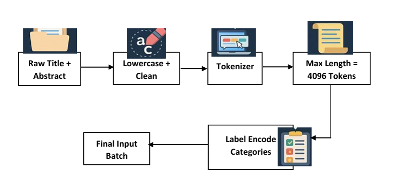

### Preprocessing Steps

1.  Remove missing values
2.  Remove unnecessary metadata
3.  Convert text to lowercase
4.  Remove special characters
5.  Combine title and abstract
6.  Prepare data for tokenization

------------------------------------------------------------------------

## Longformer Architecture

Longformer is designed to process **long documents efficiently** using
sparse attention.

### Key Features

-   Supports sequences up to **4096 tokens**
-   Uses **sliding window attention**
-   Reduces computational complexity
-   Maintains contextual understanding of long texts

------------------------------------------------------------------------

## Sliding Window Attention

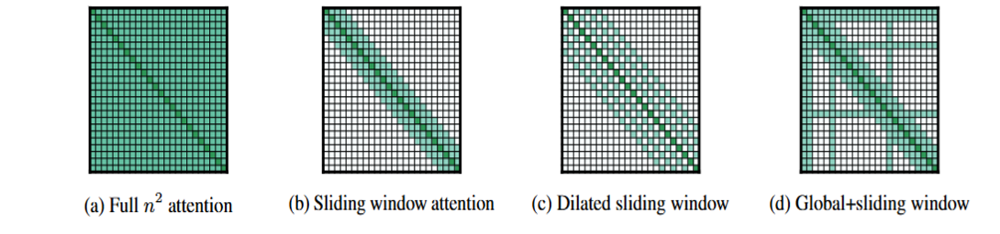

Traditional transformer complexity:

    O(n²)

Longformer complexity:

    O(n × w)

Where:

-   **n** = sequence length\
-   **w** = attention window size

------------------------------------------------------------------------

## Model Architecture Flow

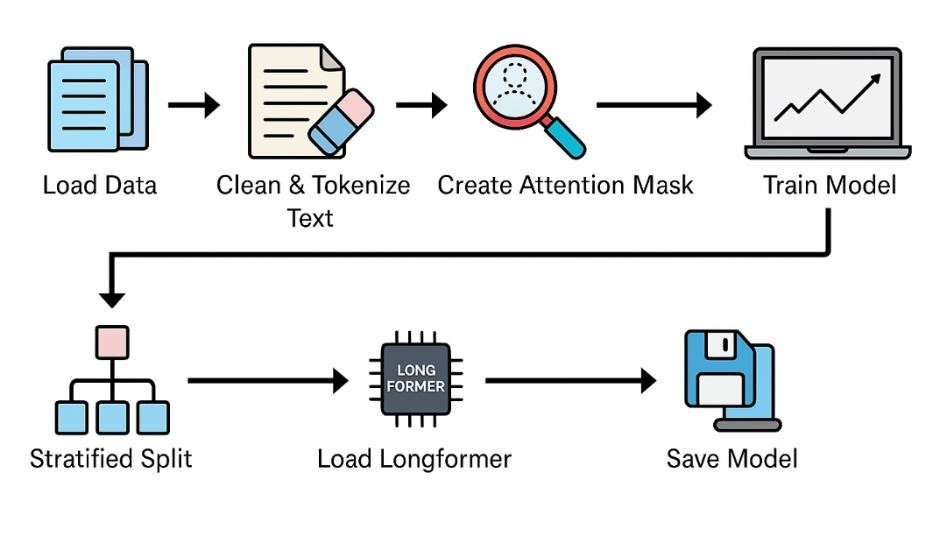

The overall workflow of the proposed document classification system
follows the pipeline shown above.

### Pipeline Steps

1. Raw research paper dataset is collected from **arXiv**
2. Data preprocessing removes noise and unnecessary metadata
3. Title and abstract are merged into a single input sequence
4. Text is tokenized using **LongformerTokenizer**
5. Tokens are passed to the **Longformer transformer encoder**
6. The classification head predicts the research category
7. Model predictions are evaluated using accuracy, precision, recall and F1-score
-------------------------------------------------------------------------------------

## Training Configuration

  Parameter       Value
  --------------- ---------------------
  Model           Longformer
  Tokenizer       LongformerTokenizer
  Optimizer       AdamW
  Loss Function   CrossEntropyLoss
  Learning Rate   5e-5
  Epochs          3
  Batch Size      4

------------------------------------------------------------------------

## Installation

Clone the repository:

``` bash
git clone https://github.com/Er-Robinson/Document-Classification-using-Longformer.git
cd Document-Classification-using-Longformer
```

Install dependencies:

``` bash
pip install -r requirements.txt
```

Required libraries:

-   PyTorch
-   Transformers
-   NumPy
-   Pandas
-   Scikit-learn

------------------------------------------------------------------------

## Model Training Example

``` python
import os
import glob
import re
import torch
import numpy as np
import pickle
import gc
import logging
import time
import pandas as pd
from datasets import Dataset
from sklearn.utils.class_weight import compute_class_weight
from sklearn.metrics import precision_recall_fscore_support
from transformers import (
    LongformerForSequenceClassification,
    LongformerTokenizerFast,
    Trainer,
    TrainingArguments,
    DataCollatorWithPadding
)

# ----------------------------
# Setup
# ----------------------------
os.environ["CUDA_VISIBLE_DEVICES"] = "0"
torch.backends.cuda.matmul.allow_tf32 = True

logging.basicConfig(
    level=logging.INFO,
    format='%(asctime)s - %(levelname)s - %(message)s',
    handlers=[
        logging.FileHandler('/kaggle/working/training_log.txt'),
        logging.StreamHandler()
    ]
)
logger = logging.getLogger(__name__)

input_dir = '/kaggle/working/'
train_tokenized_path = os.path.join(input_dir, 'train_tokenized.pkl')
val_tokenized_path = os.path.join(input_dir, 'val_tokenized.pkl')
results_dir = os.path.join(input_dir, 'results')
os.makedirs(results_dir, exist_ok=True)

# ----------------------------
# Checkpoint
# ----------------------------
def get_latest_checkpoint(results_dir):
    checkpoint_dirs = glob.glob(os.path.join(results_dir, 'checkpoint-*'))
    if not checkpoint_dirs:
        return None
    checkpoint_nums = [int(re.search(r'checkpoint-(\d+)', d).group(1)) for d in checkpoint_dirs]
    return os.path.join(results_dir, f'checkpoint-{max(checkpoint_nums)}')

checkpoint_path = get_latest_checkpoint(results_dir)
print(f"Checkpoint: {checkpoint_path}" if checkpoint_path else "No checkpoints found.")

# ----------------------------
# Load Data
# ----------------------------
with open(train_tokenized_path, 'rb') as f:
    train_tokenized = pickle.load(f)
with open(val_tokenized_path, 'rb') as f:
    val_tokenized = pickle.load(f)

def flatten_batches(batched_data):
    """Flatten list of batches into a flat list of dicts with same length input tensors."""
    flat_data = []
    for batch in batched_data:
        for i in range(len(batch['input_ids'])):
            item = {
                'input_ids': batch['input_ids'][i][:1024],
                'attention_mask': batch['attention_mask'][i][:1024],
                'labels': int(batch['labels'][i])
            }
            flat_data.append(item)
    return flat_data

train_dataset = Dataset.from_list(flatten_batches(train_tokenized))
val_dataset = Dataset.from_list(flatten_batches(val_tokenized))

del train_tokenized, val_tokenized
gc.collect()
torch.cuda.empty_cache()

# ----------------------------
# Class Weights
# ----------------------------
labels = np.array(train_dataset['labels'])
num_labels = 29
class_weights = compute_class_weight(class_weight='balanced', classes=np.unique(labels), y=labels)
class_weights_tensor = torch.tensor(class_weights, dtype=torch.float)

if len(class_weights_tensor) < num_labels:
    pad = torch.zeros(num_labels - len(class_weights_tensor))
    class_weights_tensor = torch.cat((class_weights_tensor, pad))

# ----------------------------
# Tokenizer & Model
# ----------------------------
tokenizer = LongformerTokenizerFast.from_pretrained('allenai/longformer-base-4096')
tokenizer.model_max_length = 1024

if checkpoint_path:
    model = LongformerForSequenceClassification.from_pretrained(
        checkpoint_path, num_labels=num_labels, ignore_mismatched_sizes=True
    )
else:
    model = LongformerForSequenceClassification.from_pretrained(
        'allenai/longformer-base-4096', num_labels=num_labels
    )

model.to(torch.device('cuda' if torch.cuda.is_available() else 'cpu'))

# ----------------------------
# Custom Trainer
# ----------------------------
class WeightedTrainer(Trainer):
    def __init__(self, *args, class_weights=None, **kwargs):
        super().__init__(*args, **kwargs)
        self.class_weights = class_weights

    def compute_loss(self, model, inputs, return_outputs=False, **kwargs):
        labels = inputs.pop("labels")
        outputs = model(**inputs)
        logits = outputs.logits
        loss_fct = torch.nn.CrossEntropyLoss(weight=self.class_weights.to(logits.device))
        loss = loss_fct(logits, labels)
        return (loss, outputs) if return_outputs else loss

# ----------------------------
# Metrics
# ----------------------------
def compute_metrics(pred):
    labels = pred.label_ids
    preds = np.argmax(pred.predictions, axis=1)
    precision, recall, f1, _ = precision_recall_fscore_support(labels, preds, average='weighted')
    return {
        'accuracy': (preds == labels).mean(),
        'precision_weighted': precision,
        'recall_weighted': recall,
        'f1_weighted': f1
    }

# ----------------------------
# Training Arguments
# ----------------------------
training_args = TrainingArguments(
    output_dir=results_dir,
    num_train_epochs=3,
    per_device_train_batch_size=2,
    per_device_eval_batch_size=2,
    gradient_accumulation_steps=2,
    warmup_steps=50,
    weight_decay=0.01,
    logging_dir=os.path.join(input_dir, 'logs'),
    logging_steps=10,
    logging_first_step=True,
    eval_strategy='epoch',
    save_strategy='epoch',
    load_best_model_at_end=False,
    fp16=True,
    report_to='none',
    log_level="info",
    disable_tqdm=False
)

# ----------------------------
# Trainer and Training
# ----------------------------
trainer = WeightedTrainer(
    model=model,
    args=training_args,
    train_dataset=train_dataset,
    eval_dataset=val_dataset,
    compute_metrics=compute_metrics,
    data_collator=DataCollatorWithPadding(tokenizer, padding=True),
    class_weights=class_weights_tensor,
)

print("Starting training...")
start_time = time.time()
trainer.train(resume_from_checkpoint=checkpoint_path)
end_time = time.time()

# ----------------------------
# Save Final Model
# ----------------------------
final_model_path = os.path.join(input_dir, 'final_model')
trainer.save_model(final_model_path)
print(f"Model saved to {final_model_path}")
print(f"Training completed in {(end_time - start_time)/60:.2f} minutes.")

# ----------------------------
# Save Final Evaluation Metrics
# ----------------------------
metrics = trainer.evaluate()
pd.DataFrame([metrics]).to_csv(os.path.join(input_dir, "final_eval_metrics.csv"), index=False)
print("Metrics saved to final_eval_metrics.csv")

# Cleanup
del model, trainer
torch.cuda.empty_cache()
gc.collect()

```

------------------------------------------------------------------------

## Experimental Results

### BERT Baseline

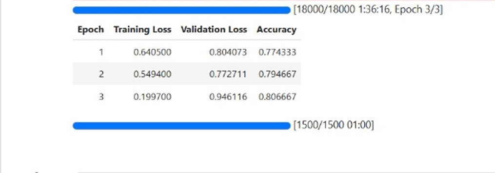

BERT struggles with long documents due to the **512 token limit**.

------------------------------------------------------------------------

### Longformer Base Model

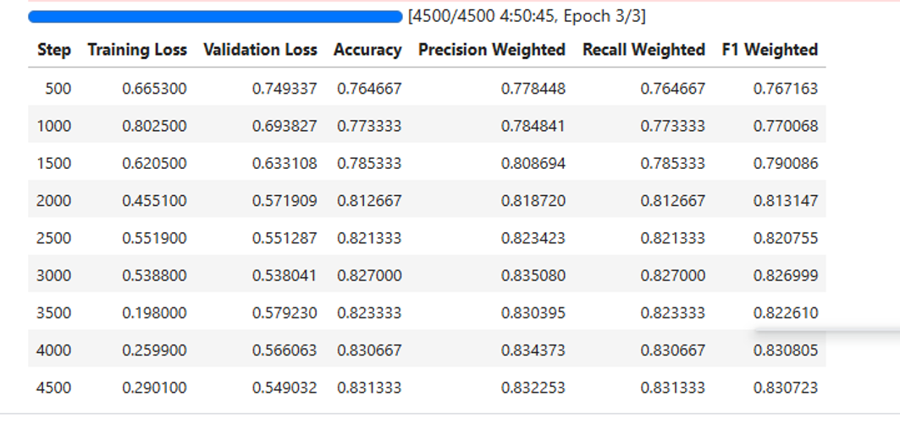

Longformer captures long-range dependencies and improves classification
performance.

------------------------------------------------------------------------

### Longformer Large Model

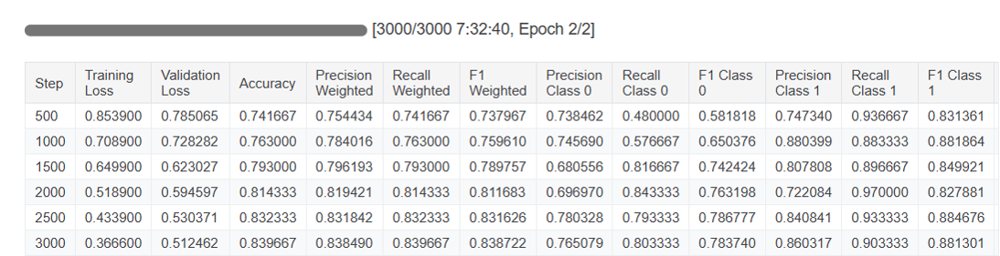

The larger Longformer architecture provides improved representation
learning.

------------------------------------------------------------------------

### Additional Longformer Evaluation

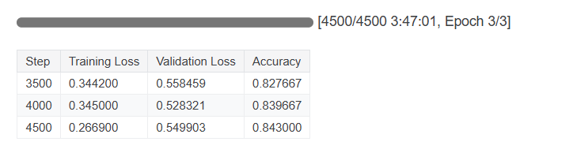

------------------------------------------------------------------------

## Overall Model Accuracy

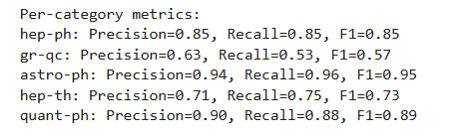

**Final Accuracy: 84.3%**

------------------------------------------------------------------------

## Model Comparison

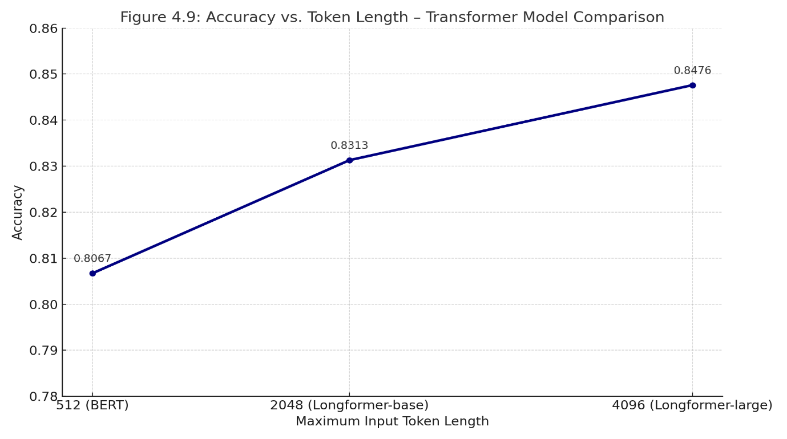

The figure above compares the performance of three transformer models:

- **BERT**
- **Longformer Base**
- **Longformer Large**

### Observations

• **BERT**
- Limited to 512 tokens
- Cannot capture long contextual information

• **Longformer Base**
- Handles long sequences efficiently
- Improves classification performance

• **Longformer Large**
- Higher representation capacity
- Best performance among all models

This experiment demonstrates that **transformers designed for long
documents significantly outperform standard BERT models** when working
with research papers.
------------------------------------------------------------------------

## Prediction Examples

### Prediction Example 1

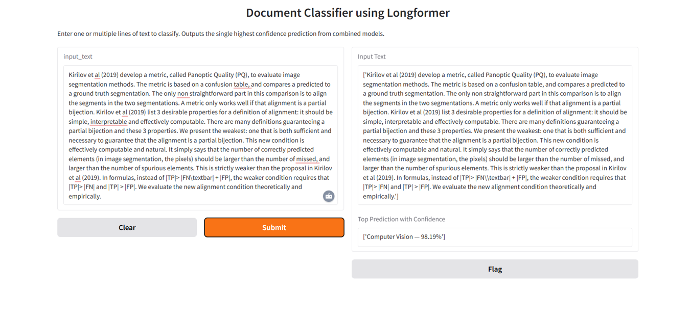

### Prediction Example 2

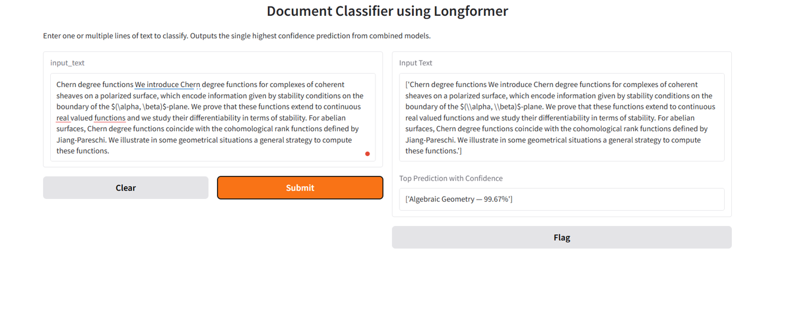

------------------------------------------------------------------------

## Project Structure

    Document-Classification-using-Longformer
    │
    ├── data
    ├── images
    │   ├── data_preprocessing.png
    │   └── sliding_window.png
    ├── results
    │   ├── bert_accuracy.jpg
    │   ├── long_accuracy.png
    │   ├── longLarge_accuracy.png
    │   ├── longLarge_accuracy2.png
    │   ├── overall_acc.png
    │   ├── prediction.png
    │   └── prediction2.png
    ├── models
    ├── notebooks
    └── README.md

------------------------------------------------------------------------

## Applications

This system can be used for:

-   scientific literature classification
-   legal document categorization
-   news article classification
-   academic search engines
-   digital library indexing

------------------------------------------------------------------------

## Future Work

Possible improvements:

-   Training on **full research papers instead of abstracts**
-   Exploring models such as **BigBird**
-   Adding **attention visualization**
-   Deploying the model as an **API service**

------------------------------------------------------------------------

## References

-   Beltagy, I., Peters, M., & Cohan, A. (2020) -- *Longformer: The
    Long-Document Transformer*
-   Devlin, J. et al. (2019) -- *BERT: Pre-training of Deep
    Bidirectional Transformers*
-   Vaswani, A. et al. (2017) -- *Attention Is All You Need*

------------------------------------------------------------------------

## Author

**Robinson**

Machine Learning • Natural Language Processing • Deep Learning

GitHub: https://github.com/Er-Robinson\
LinkedIn: https://linkedin.com/in/Er-robinson

------------------------------------------------------------------------

⭐ If you find this project useful, please consider **starring the
repository**.
